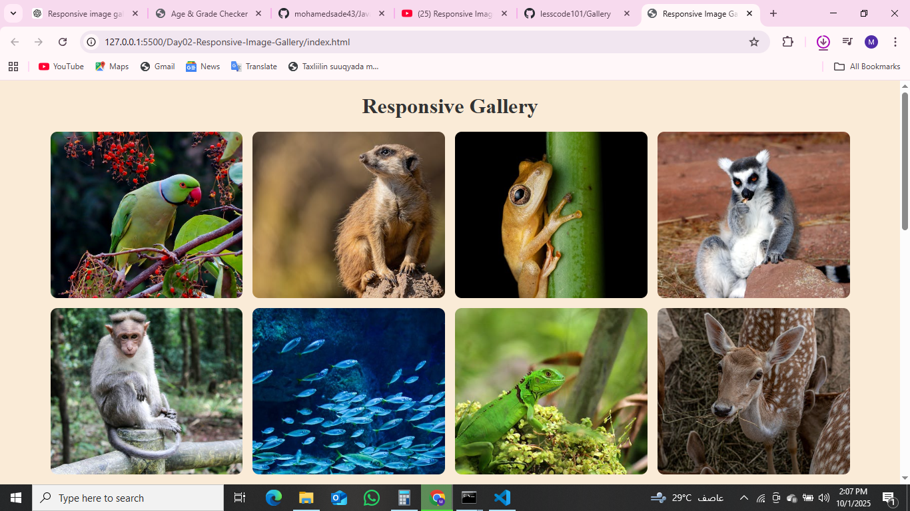

# 📸 Responsive Image Gallery



A simple and **responsive image gallery** built with **HTML5** and **CSS Grid**.  
It automatically adjusts the number of columns based on screen size (desktop, tablet, mobile).  

---

## 🚀 Features
- ✅ Responsive layout using **CSS Grid**
- ✅ Clean and minimal design
- ✅ Works on all devices (mobile-first)
- ✅ Lightweight, no JavaScript required

---

## 🛠️ Technologies Used
- **HTML5**
- **CSS3 (Grid & Flexbox)**

---

## 📂 Project Structure
```bash
responsive-gallery/
├── index.html      # Main HTML file
├── style.css       # CSS styles
└── images/         # Gallery images
