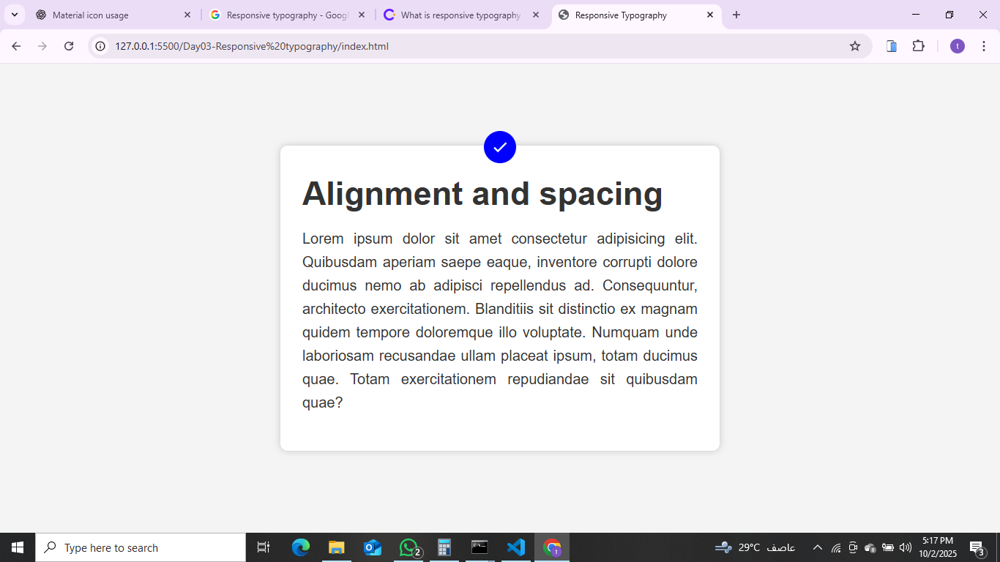

# 📘 Responsive Typography with Material Icons

This mini project demonstrates how to build a **responsive typography system** using  
CSS `clamp()` + `media queries` and Google **Material Icons**.

---

## 🚀 Features
- ✅ **Responsive Typography** (works on all screens: mobile, tablet, desktop)  
- ✅ Uses **CSS clamp()** for dynamic font scaling  
- ✅ Clean **Google Fonts (Poppins)** integration  
- ✅ Material Icons support (e.g., ✅ check mark)  
- ✅ Mobile-first design with media queries  

---

## 🛠️ Installation
Clone the repository or download the files:

```bash
git clone https://github.com/your-username/responsive-typography.git

Open index.html in your browser. 🎉

📂 Project Structure
.
├── index.html   # Main HTML file
├── style.css    # Styles (responsive typography + icons)
└── README.md    # Documentati

screen shoots fort this project
